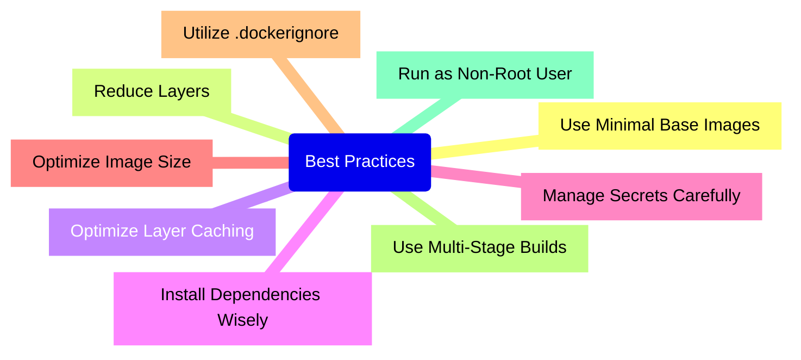
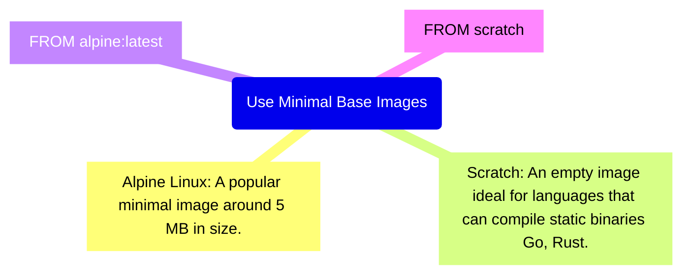

---
# You can also start simply with 'default'
theme: seriph
# random image from a curated Unsplash collection by Anthony
# like them? see https://unsplash.com/collections/94734566/slidev
background: https://cdn.jsdelivr.net/gh/slidevjs/slidev-covers@main/static/VLaKsTkmVhk.webp
# some information about your slides (markdown enabled)
title: Welcome to Dockerfile best practices techtalk
info: |
  ## Dockerfile Best Practices
  NUS Technology - Feb 26, 2025

  Learn more at [Sli.dev](https://sli.dev)
# apply unocss classes to the current slide
class: text-center
# https://sli.dev/features/drawing
drawings:
  persist: false
# slide transition: https://sli.dev/guide/animations.html#slide-transitions
transition: slide-left
# enable MDC Syntax: https://sli.dev/features/mdc
mdc: true
---

# Dockerfile Best Practices Techtalk

How to Create Efficient Containers

NUS Technology - Feb 26, 2025

<!--
Containerization allows developers to package applications and their dependencies into a single, portable unit, ensuring predictability, scalability, and rapid deployment. However, the efficiency of your containers largely depends on how optimally your Dockerfile is written.
In this article, we’ll explore best practices for creating Dockerfiles that help you build lightweight, fast, and secure containers.
-->

---
transition: fade-out
layout: two-cols
---

# What Is a Dockerfile?

A Dockerfile is a text document containing a set of instructions to assemble a Docker image.

Each instruction performs a specific action, such as installing packages, copying files, or defining startup commands.

Proper use of Dockerfile instructions is crucial for building efficient containers.

::right::

<div style="padding: 0 20px;">
```dockerfile
FROM ruby:2.7.4

RUN curl -fsSL https://deb.nodesource.com/setup_14.x | bash -
RUN apt-get install -y nodejs
RUN apt-get update -y

RUN mkdir /app
WORKDIR /app

RUN gem install bundler

COPY Gemfile .
RUN bundle install

COPY . /app

COPY entrypoint.sh /usr/bin/
RUN chmod +x /usr/bin/entrypoint.sh
ENTRYPOINT ["entrypoint.sh"]
EXPOSE 3000

CMD ["rails", "server", "-b", "0.0.0.0"]
```
</div>

<!--
A Dockerfile is a text document containing a set of instructions to assemble a Docker image.
Each instruction performs a specific action, such as installing packages, copying files, or defining startup commands.
Proper use of Dockerfile instructions is crucial for building efficient containers.
-->


---
transition: slide-up
level: 2
---

# Key Dockerfile Instructions

```ts
FROM: Sets the base image for your new image.

RUN: Executes a command in a new layer on top of the current image and commits the result.

CMD: Specifies the default command to run when a container is started.

COPY: Copies files and directories from the build context into the container filesystem.

ADD: Similar to COPY but with additional features like extracting archives.

ENV: Sets environment variables.

EXPOSE: Informs Docker which ports the container listens on at runtime.

ENTRYPOINT: Configures a container to run as an executable.

VOLUME: Creates a mount point for external storage volumes.

WORKDIR: Sets the working directory for subsequent instructions.
```


---
transition: fade-out
layout: cover
---



---
transition: slide-up
---

The base image serves as the foundation for your Docker image. Choosing a lightweight base image can significantly reduce the final image size and minimize the attack surface.

```dockerfile
FROM alpine:latest
##
FROM scratch
COPY myapp /myapp
CMD ["/myapp"]
```



<!--
Pros: Small size, security, fast downloads.
Cons: May require additional configuration; some packages might be missing or behave differently due to using musl instead of glibc.
-->

---
transition: slide-up
---

# Reduce Layers

Each `RUN`, `COPY`, and `ADD` instruction adds a new layer to your image. Combining commands helps reduce the number of layers and the overall image size.

Inefficient:

```dockerfile
RUN apt-get update
RUN apt-get install -y python
RUN apt-get install -y pip
```

More Efficient:

```dockerfile
RUN apt-get update && apt-get install -y \
    python \
    pip \
 && rm -rf /var/lib/apt/lists/*
```

---
transition: slide-up
---

# Optimize Layer Caching

Docker uses layer caching to speed up builds. The order of instructions affects caching efficiency.

Copy Dependency Files First:

- Copy files that change less frequently (like package.json or requirements.txt) before copying the rest of the source code.

Minimize Changes in Early Layers:

- Changes in early layers invalidate the cache for all subsequent layers.


---
transition: slide-up
---

# Install Dependencies Wisely

Remove temporary files and caches after installing packages to reduce image size.

```dockerfile
RUN pip install --no-cache-dir -r requirements.txt
```

---

# Manage Secrets Carefully

Never include sensitive data (passwords, API keys) in your Dockerfile:

Use Environment Variables:

> Pass secrets at runtime using environment variables.

Leverage Docker Secrets:

> Use Docker Swarm or Kubernetes mechanisms for managing secrets.


---

# Optimize Image Size

Delete Unnecessary Files:

> Clean up caches, logs, and temporary files within the same RUN command as the installation.

> This ensures that these temporary files do not persist in any intermediate layers, effectively reducing the final image size.

```dockerfile
RUN apt-get update && apt-get install -y --no-install-recommends package \
      && apt-get clean && rm -rf /var/lib/apt/lists/*
```

Minimize Installed Packages:

> Install only the packages you need by using flags like --no-install-recommends. This avoids pulling in unnecessary dependencies, further slimming down the image.

```dockerfile
RUN apt-get install -y --no-install-recommends package
```

Use Optimization Tools:

> Utilize tools like Docker Slim which can automatically analyze and optimize your Docker images by removing unnecessary components and reducing their size without altering functionality.


---

# Utilize .dockerignore

A .dockerignore file lets you exclude files and directories from the build context, reducing the amount of data sent to the Docker daemon and protecting sensitive information.

```ts
Example .dockerignore

.git
node_modules
Dockerfile
.dockerignore
```

---

# Use Multi-Stage Builds

Multi-stage builds allow you to use intermediate images and copy only the necessary artifacts into the final image.

```dockerfile
FROM golang:1.23 AS build
WORKDIR /src
COPY <<EOF /src/main.go
package main

import "fmt"

func main() {
  fmt.Println("hello, world")
}
EOF
RUN go build -o /bin/hello ./main.go

FROM scratch
COPY --from=build /bin/hello /bin/hello
CMD ["/bin/hello"]
```

The end result is a tiny production image with nothing but the binary inside. None of the build tools required to build the application are included in the resulting image.

<!--
You only need the single Dockerfile. No need for a separate build script. Just run docker build.

docker build -t hello .

The end result is a tiny production image with nothing but the binary inside. None of the build tools required to build the application are included in the resulting image.

How does it work? The second FROM instruction starts a new build stage with the scratch image as its base. The COPY --from=0 line copies just the built artifact from the previous stage into this new stage. The Go SDK and any intermediate artifacts are left behind, and not saved in the final image.
-->

---

# Run as Non-Root User

For enhanced security, avoid running applications as the root user.

```dockerfile
RUN adduser -D appuser
USER appuser
```

<!-- By default Docker containers will run as UID 0, or root. This means that if the Docker container is compromised, the attacker will have host-level root access to all the resources allocated to the container. -->


---

# Additional Recommendations

Pin Versions: Use specific versions of base images and packages to ensure build reproducibility.

```dockerfile
FROM node:14.17.0-alpine
```

Stay Updated: Regularly update dependencies and base images to include security patches.

Use Metadata: Add LABEL instructions to provide image metadata.

Set Proper Permissions: Ensure files and directories have appropriate permissions.

Avoid Using Root: Always switch to a non-root user for running applications.

---

# Example for Node.js Application

```dockerfile
# Use the official Node.js image based on Alpine Linux
FROM node:14-alpine

# Set the working directory
WORKDIR /app

# Copy package files and install dependencies
COPY package*.json ./
RUN npm ci --only=production

# Copy the rest of the application code
COPY . .

# Create a non-root user and switch to it
RUN addgroup appgroup && adduser -S appuser -G appgroup
USER appuser

# Expose the application port
EXPOSE 3000

# Define the command to run the app
CMD ["node", "app.js"]
```


---
layout: cover
class: text-center
background: https://cdn.jsdelivr.net/gh/slidevjs/slidev-covers@main/static/w68kZc0L69w.webp
---

# Thank you!

